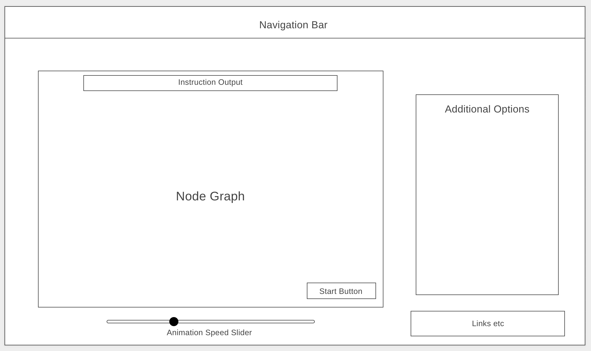

# Background:

Dijkstra’s Algorithm algorithm determines the shortest distance between all nodes in a multi-node system. Functionality useful for mapping efficiency and shortest pathing between nodes. This visualization allows a user to select a starting and ending node, and see an animation depicting each iteration of the algorithm (by highlighting each node/path) as it determines the shortest distance pathing between all nodes. It then highlights the optimal path. 

Additional functionality as follows. First, removal and/or creation of nodes/pathing on click/drag. Second, ‘traffic simulation’ allowing the user to increasing the ‘travel time’ between the nodes on-click, potentially re-routing the shortest path. Third, multiple nodes of transportation each with its own associated ‘travel time’ — walking vs. subway/public transportation vs. driving. Fourth, toggling between pathing options such as ‘fastest’, ‘fewest transfers’, ‘lowest price.’ Later expansion potential for actual map overlay. 

# Functionality & MVPs:

With the Path Optimizer visualization, users will be able to:

Select a starting and ending node.
Through point/click functionality, interactively increase or the 'travel time' between nodes.
Play an animation visualizing the process of Dijkstra's Algorithm.

In addition, this project will include:

The ability for the user to move nodes on the grid.
An active slider to increase/decrease the animation speed. 
An instruction set readme.

# Basic Layout:

- Navigation Bar
- Input instructions displaying what the user should do
- Node Graph displaying the nodes and paths between the nodes on the graph.
- A button to begin/pause/stop the animation
- A slider to increase/decrease animation speed
- An additional options panel fo interactive options
- Links to github and Linked in

# This project will be implemented with the following technologies:

1. Canvas will be used to render the graph
2. Webpack to bundle the source JavaScript code
3. npm to manage project dependencies

# Implementation Timeline:

Thursday Afternoon: Begin project skeleton and complete project proposal. Create Node, Path, Graph classes. Implement Canvas and add draw functionality to each class. 

Friday Afternoon & Weekend: Implement Dijkstra's algorithm with a predetermined start/end to iterate through nodes/paths. Add in a variable timeout delay to account for animation. Add animation to algorithm iterations to highlight active nodes/paths. 

Monday: Ensure the algorithm and animation are working properly. Develop event listener/handler for the user to select start/ending nodes. Construct new graph on load of page. Instantiate event handling with a start button and slider to and slow the animation. 

Tuesday: Continue event handling. Develop logic for the user to drag/drop nodes, include recalculation of pathing between nodes. Add 'traffic' option to increase travel times between nodes. CSS styling.

Wednesday: Finish implementing of any outlying features. Look into adding functionality for map over/lay and differing modes of transportation. 

Thursday Morning: Deploy to GitHub pages. If time, rewrite this proposal as a production README.