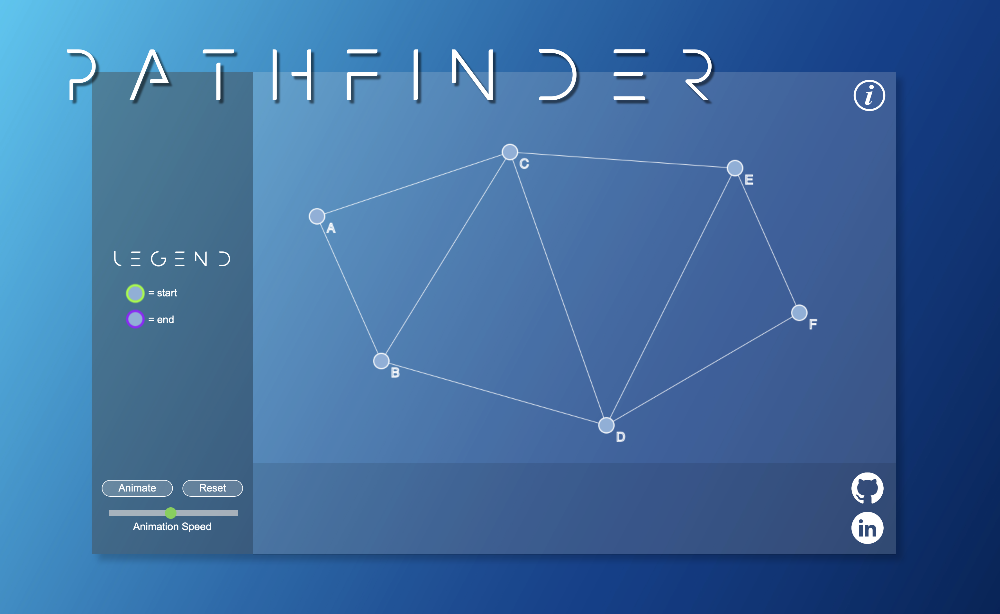

# Pathfinder

[Pathfinder](https://logan-hart.github.io/pathfinder/)

## Functionality:

The algorithm in this application determines the shortest paths between nodes in a graph, which may represent, for example, road networks. For any given source node in the graph, the algorithm finds the shortest path between that node and every other. It then determines the shortest distance between the beginning and ending nodes and highlights that path.

To begin, click on a node on the graph to select it as the starting point. The next node you click will serve as your ending node. By clicking animate, you will start the algorithm process of determining the shortest path between the beginning and ending nodes.
The algorithm on this page dynamically determines the shortest distance between all nodes on the graph and highlights the shortest path between the starting and ending node. It was developed from the ground up by referencing the psuedo-code for Dijkstra's shortest path algorithm. 

Nodes may be dragged/dropped to a new location on the graph and the distance dynamically updates. The slider at the bottom increases/decreases the animation time. 

Planned future functionality includes. ‘Traffic simulation’ allowing the user to increasing the ‘travel time’ between the nodes on-click.

 Multiple nodes of transportation each with its own associated ‘travel time’ — walking vs. subway vs. driving. Toggling between pathing options such as 'distance' ‘fastest’, ‘fewest transfers’, ‘lowest price.’ Actual map overlay . 

## The Algorithm:

This algorithm was built from the ground up based on the pseudo-code for Dijkstra's algorithm.

```js
Algorithm.prototype.determinePathing = function(){
    let map = this.buildMap()
    
    let currentNode = this.startNode.name
    let unvisitedNodes = Object.keys(map)
    let shortestDist = {}
    let path = {}
    Object.keys(map).forEach(function(el){
      path[el] = []
    })

    this.nodes.forEach( function(node){
        shortestDist[node.name] = Infinity
    })

    shortestDist[currentNode] = 0    
    path[currentNode] = [0, currentNode]
    
    while (unvisitedNodes.length > 0){
        currentNode = Object.entries(shortestDist)
        .filter(([key]) => unvisitedNodes.includes(key))
        .sort((a, b) => a[1] - b[1])[0][0];
        this.visitedNodes.push(currentNode)
        unvisitedNodes = unvisitedNodes.filter(el => el !== currentNode)
        
        let distToCurrent = shortestDist[currentNode]
        Object.keys(map[currentNode]).forEach(function(el){
            if (shortestDist[el] > map[currentNode][el] + distToCurrent){
                shortestDist[el] = map[currentNode][el] + distToCurrent
            }
            if (path[el].length === 0){
                path[el] = [(map[currentNode][el] + distToCurrent), currentNode]
            }
        })
    }
    this.path = path
}
```

## Drag/Drop functionality

To distinguish between Click and drag/drop functionality the location of the mouse-down event is compared to the location of the mouse-up event.

```js
let is_dragging = false
  let startX
  let startY
  let dragNode
  let downPos

  graphcanvas.addEventListener('mousedown', function(e){
    [startX, startY] = getMousePosition(graphcanvas, e)
    downPos = Array.from(getMousePosition(graphcanvas, e))
    Object.keys(g.nodeHitBoxes).forEach (function (el){
      let hitbox = g.nodeHitBoxes[el]
      if (startX > hitbox[2] && startX < hitbox[3] && startY > hitbox[0] && startY < hitbox[1]){
        dragNode = g.nodes.find(node => node.name === el)
        is_dragging = true
        return
      }
    })
  })

  let mouse_up = function(e){
    e.preventDefault();
    let [currentX, currentY] = getMousePosition(graphcanvas, e)
    let distance = Math.sqrt(Math.pow(currentX- downPos[0], 2) + Math.pow(currentY - startY, 2));
    if (distance < 1){
      Object.keys(g.nodeHitBoxes).forEach (function (el){
        let hitbox = g.nodeHitBoxes[el]
        if (startX > hitbox[2] && startX < hitbox[3] && startY > hitbox[0] && startY < hitbox[1]){
          let found = g.nodes.find(node => node.name === el)
          let result = selectedSpaceship()
          if (result === -1){
            found.selected = 'start'
          } else if (result === 0 && found.selected !== 'start'){
            found.selected = 'end'
          } else if (found.selected === 'end'){
            found.selected = 'none'
          } else{
            g.clearSelected()
          }
          g.draw(ctx)
        }
      })
    } 
    if (!is_dragging){
      return;
    }
    is_dragging = false
  }
```

# Original Concept:


# This project implements with the following technologies:

1. Canvas for rendering the interactive graph
2. Webpack to bundle the source JavaScript code 
3. Bable for interpolation
4. Node Package Manger to manage project dependencies
